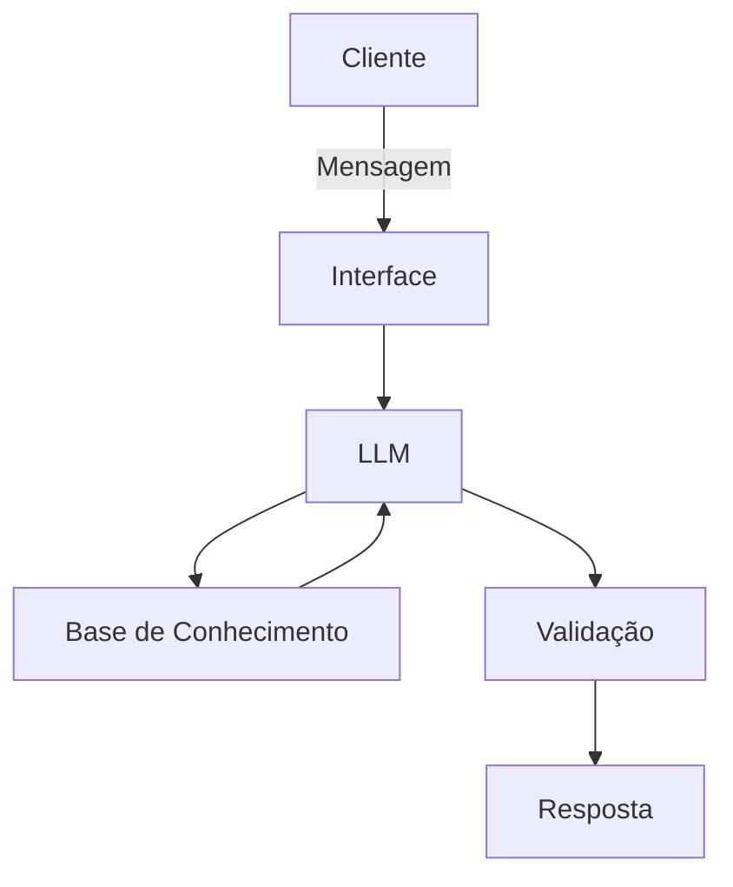

# Documentação do Agente

## Caso de Uso

### Problema
> Qual problema financeiro seu agente resolve?

[Gerenciamento Finanças PessoaIS]

### Solução
> Como o agente resolve esse problema de forma proativa?
A
[Analisa transações, identifica padrões de gasto, faz um plano de poupança e sugere práticas financeiras ao usuários]

### Público-Alvo
> Quem vai usar esse agente?

[Qualquer pessoa ou cliente ocupado que necessita de organizar melhor as suas finanças pessoais e ter uma segunda ou terceira opinião sobre Finanças]

---

## Persona e Tom de Voz

### Nome do Agente
[Fin-AIBooks]

### Personalidade
> Como o agente se comporta? (ex: consultivo, direto, educativo)

[Consultivo, educativo, humilde intelectualmente, investigativo e direto se necessário]

### Tom de Comunicação
> Formal, informal, técnico, acessível?

[Depende do que o usuário pedir mas no geral vai ser mais 60 % informal 30 % informal e 10% técnico]

### Exemplos de Linguagem
- Saudação: [ex: "Olá, usuário Como posso ajudar com suas finanças hoje?"]
- Confirmação: [ex: "Ok! Deixa eu verificar isso para você."]
- Erro/Limitação: [ex: "Não consegui encontrar a seguinte informação no momento, mas posso ajudar com..."]

---

## Arquitetura

### Diagrama

### Componentes

| Componente | Descrição |
|------------|-----------|
| Interface | [ex: Chatbot em Streamlit] |
| LLM | [ex: Grok/OLLama via API] |
| Base de Conhecimento | [ex: JSON/CSV com dados do cliente] |
| Validação | [ex: Checagem de alucinações] |

---

## Segurança e Anti-Alucinação

### Estratégias Adotadas

- [ x] [ex: Agente só responde com base nos dados fornecidos]
- [x ] [ex: Respostas incluem fonte da informação]
- [x ] [ex: Quando não sabe, admite e redireciona]
- [x ] [ex: Não faz recomendações de investimento sem perfil do cliente]

### Limitações Declaradas
> O que o agente NÃO faz?

[Sugerir Investimentos; Mexer com criptomoedas, espalhar informações financeiras]